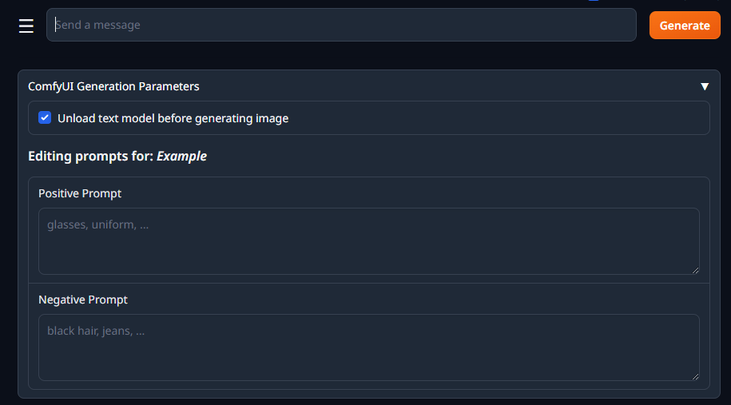

# SKDV's ComfyUI Image Generation

>This extension provides image generation from ComfyUI inside oobabooga's text generation webui.

>**Disclaimer**: this extension is in no way, shape or form associated with ComfyUI.

## General features
- Customize any image parameters from ComfyUI:
	- Model
	- VAE
	- Resolution presets (and individual width & height)
	- Sampler
	- Scheduler
	- Steps
	- CFG Scale
	- Fixed and random seeds
- Import your workflows (API format)
- Use custom variables that are injected at generation
- Generation buttons directly from the chat tab
- Workflow code editor (basic)

### Roleplaying parameters
- Add quality parameters that apply to all characters
- Add custom prompts for different characters
- Edit prompts before generating [NOT DONE]
- Allow your text model to generate a positive prompt description


### Workflow Editor
- Send your avatar image to the workflow
- Send the character's avatar image to the workflow


### Settings and Quality of Life
- Automatic model unloading for WebUI and ComfyUI models to save VRAM
- Extension updater


## Installation
You need a little bit of coding knowldge (close to none, but the more the better).

If you used a 'one-click-installer', open the `CMD_FLAGS.txt` file inside your installation folder.

To activate the extension, you must add the following to an existing line or new line (if no other startup flags are used):
```
--extensions skdv_comfyui
```

With this, the extension activates and you will see upon restart of the WebUI a new section with the extension contents.

For more information on how to install and activate users, please refer to the [original documentation by oobaboga](https://github.com/oobabooga/text-generation-webui/blob/main/docs/Extensions.md)

## Support me!
This extension takes some time to make, and I love working on it and fixing it for the community.

Want to support my development? Donate me over [Paypal](https://paypal.me/skinnydevi)!

## Extension screenshots

### Custom character prompts in chat


### Generation parameters


### Shared character prompts


### Workflow editor
