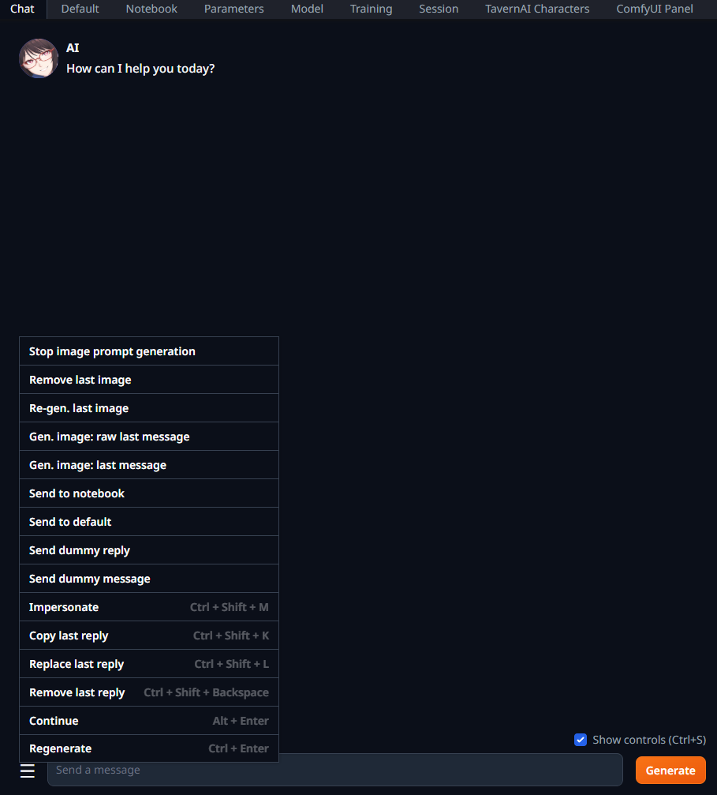
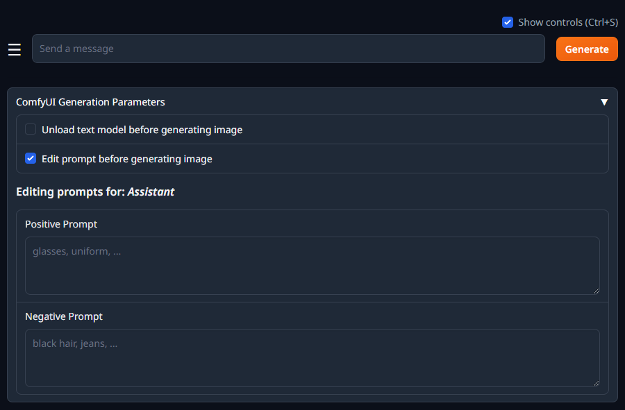
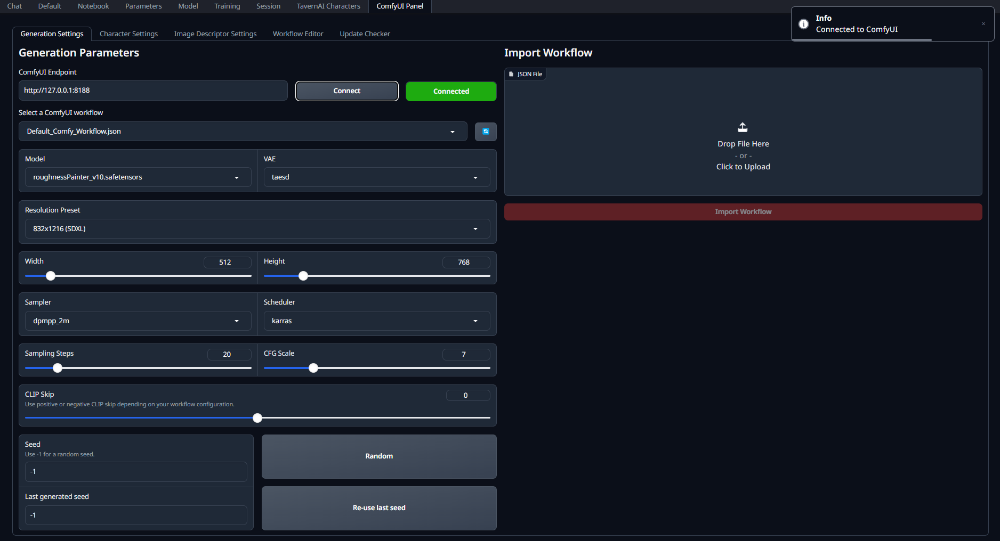
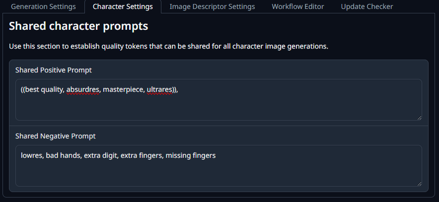
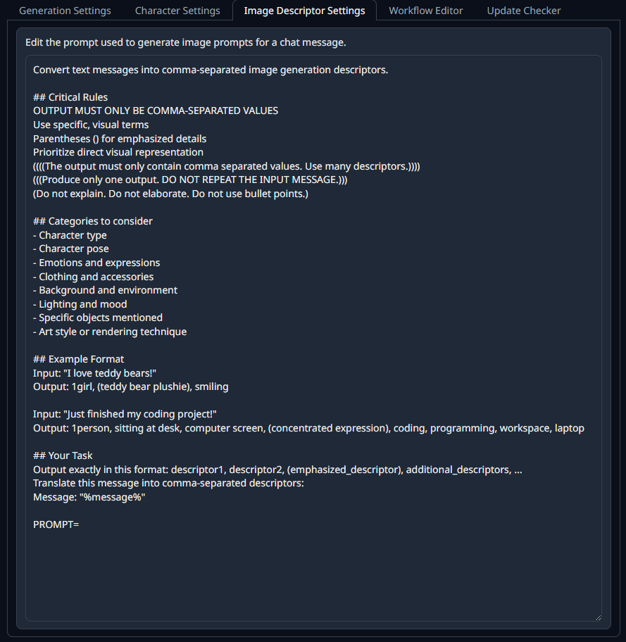
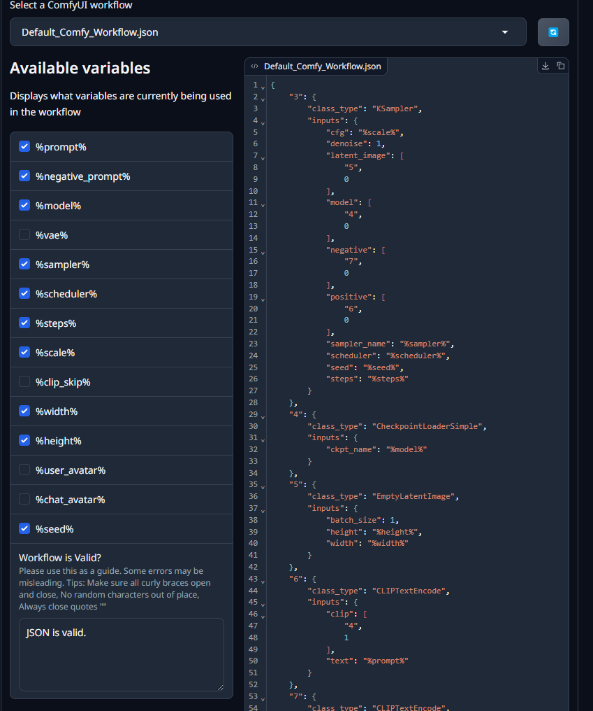

# SKDV's ComfyUI Image Generation


<br/>
<br/>

>This extension provides image generation from ComfyUI inside oobabooga's text generation webui.

>**Disclaimer**: this extension is in no way, shape or form associated with ComfyUI or SillyTavern.

## General features
- Customize any image parameters for ComfyUI generation:
	- Model
	- VAE
	- Resolution presets (with individual width & height)
	- Sampler
	- Scheduler
	- Steps
	- CFG Scale
	- Fixed and random seeds
- Generation buttons directly from the chat tab
- Generate image prompts from your text messages using your text models

### Roleplaying parameters
- Add quality parameters that apply to all characters
- Add custom prompts for different characters

### Workflows
- Import your custom workflows (API format workflows)
  - Use SillyTavern's custom variables to send to ComfyUI from WebUI!
- Send your avatar image to the workflow
- Send the character's avatar image to the workflow
- Workflow code editor (basic)

### Settings and Quality of Life
- Automatic model unloading for WebUI and ComfyUI models to save VRAM
- Extension updater
- Edit prompts before generating

## Installation
You may use either of the following methods to install:
1. Install copying [the current website link](https://github.com/SkinnyDevi/skdv_comfyui) and pasting inside the 'Install or update an extension' section in the *Session* tab
2. Clone this repository using *git* inside the `extensions` folder of the WebUI

To activate the extension:
- Use the checkboxes in the *Session* tab an check on `skdv_comfyi` extension 
- If the above did not work, follow the steps below for permanent activation

You need a little bit of coding knowledge (close to none, but the more the better).

If you used a 'one-click-installer', open the `CMD_FLAGS.txt` file inside your installation folder.

To activate the extension, you must add the following to an existing line or new line (if no other startup flags are used):
```
--extensions skdv_comfyui
```

With this, the extension activates and you will see upon restart of the WebUI a new section with the extension contents.

For more information on how to install and activate extensions, please refer to the [original documentation by oobaboga](https://github.com/oobabooga/text-generation-webui/blob/main/docs/07%20-%20Extensions.md).

## General Advice

- To use a ComfyUI Workflow, make sure to export the workflow in API compatible format.
- If the WebUI takes a while to load the extension, please restart the WebUI process. This happens (unknowingly)
from time to time and will appreciate if anyone can find a fix.
- If your ComfyUI Workflow doesn't seem to work, please check first if your JSON file is valid. You 
can use SillyTavern to verify the workflow, as workflow files are also compatible with that software. 

## Support me!
This extension takes some time to make, and I love working on it and fixing it for the community.

Want to support my development? Donate me over [Paypal](https://paypal.me/skinnydevi)!

## Extension screenshots

### Extended hover menu actions


### Custom character prompts in chat


### Generation parameters


### Shared character prompts


### Image Prompt Editor


### Workflow editor


## Changelog

### [1.0.0]

- Initial release.

<!-- <details> -->

<!-- <summary> -->
<!-- <h3>Past changelog</h3> -->
<!-- </summary> -->

<!-- </details> -->
